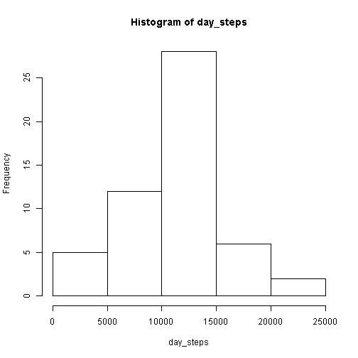
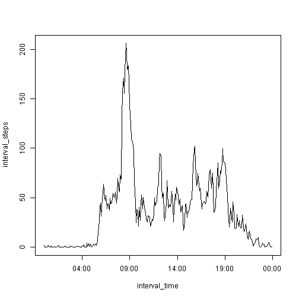
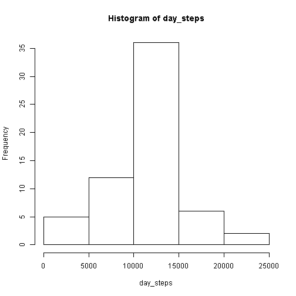
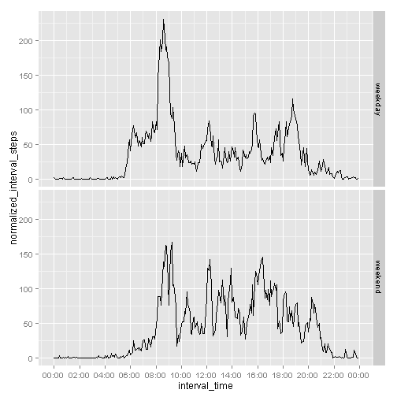

## Loading and preprocessing the data

We unzip the zip file (provided in the master branch), read the data and convert the date strings to Date objects.


```r
unzip("activity.zip")
activity_data <- read.csv("activity.csv", stringsAsFactors=FALSE)
activity_data$date <- as.Date(activity_data$date)
```


## What is the mean total number of steps taken per day?

The following histogram shows the distribution of number of steps per day. 
Missing values are just dropped.


```r
library(plyr)
daily_summary <- ddply(activity_data,.(date),summarize, day_steps = sum(steps))
with(daily_summary, hist(day_steps))
```

 

```r
step_mean <- mean(daily_summary$day_steps, na.rm = TRUE)
step_median <- median(daily_summary$day_steps, na.rm = TRUE)
```

The mean number of steps per day is 10766.19. 
The median is 10765.


## What is the average daily activity pattern?

We now calculate the average number of steps for each 5 minute time interval, across days. Missing values are ignored (dropped). The plot below gives an overview of the average daily activity pattern.


```r
interval_summary <- ddply(activity_data,.(interval),summarize, 
                          interval_steps = mean(steps, na.rm = TRUE))
## add leading zeros to the interval names, so we can parse them to HH:MM times
interval_summary$interval_time <- strptime(formatC(interval_summary$interval, 
                                                   width=4, flag="0"),
                                           format = "%H%M")

with(interval_summary, plot(interval_time, interval_steps, type='l'))
```

 

```r
max_5min_steps <- max(interval_summary$interval_steps)
best_interval <- interval_summary$interval[interval_summary$interval_steps == max_5min_steps]
best_interval_time <- format(as.POSIXct(strptime(formatC(best_interval, width=4, flag="0"), 
                                                 format = "%H%M")), 
                             "%H:%M")
```

The 5-minute time interval with the highest average number of steps is the one starting at 08:35.


## Imputing missing values

```r
number_of_NAs <- sum(is.na(activity_data$steps)) 
```


There are 2304 missing "steps" values in the data set, out of 17568 observations.

In order to get an analysis that is not skewed by missing measurements, we'll input reasonable values for the missing ones. We judge that the fairest input for an interval on a particular day is the mean of the values for that same time interval on the days that do have a value. When we look at the resulting histogram for steps per day, we see that the central peak has grown higher. This is explained later.


```r
## merge summary data per interval with original data in a new dataset, 
## and add a new column representing a reasonable guess for the steps in that interval
normalized_activity_data <- merge(activity_data, interval_summary, by="interval")
normalized_activity_data$normalized_steps <- ifelse(is.na(normalized_activity_data$steps), 
                                                    normalized_activity_data$interval_steps, 
                                                    normalized_activity_data$steps)

normalized_daily_summary <- ddply(normalized_activity_data,
                                  .(date),
                                  summarize, 
                                  day_steps = sum(normalized_steps))

with(normalized_daily_summary, hist(day_steps))
```

 

```r
normalized_step_mean <- mean(normalized_daily_summary$day_steps, na.rm = TRUE)
normalized_step_median <- median(normalized_daily_summary$day_steps, na.rm = TRUE)
```

After this correction, the mean number of steps per day is 10766.19. The median is 10766.19. 
At first sight this is surprising: the mean is equal to the median is equal to the sum of all default values of all 5-minute intervals. It turns out this is due to the pattern of the missing values in the original data: 8 entire days out of the 61 are missing and all time intervals in all other days have a proper value, so each of these 8 days gets normalized to the same "average" day. This is also why the central peak in the histogram is now higher: the 8 previously missing days are now added to it.

## Are there differences in activity patterns between weekdays and weekends?

We now introduce the concept of weekday / weekend day.


```r
## set locale to get English day names
Sys.setlocale("LC_TIME", "English")
```

```
## [1] "English_United States.1252"
```

```r
library(ggplot2)
library(scales)

normalized_activity_data$day_of_week <- weekdays(normalized_activity_data$date)
normalized_activity_data$day_type <- 
        as.factor(ifelse(normalized_activity_data$day_of_week == "Saturday" | 
                             normalized_activity_data$day_of_week == "Sunday", 
                         "weekend", 
                         "weekday"))
   
normalized_interval_summary <- ddply(normalized_activity_data,
                                     .(interval,day_type),
                                     summarize, 
                                     normalized_interval_steps = mean(normalized_steps))
normalized_interval_summary$interval_time <- 
    as.POSIXct(strptime(formatC(normalized_interval_summary$interval, width=4, flag="0"), 
                        format = "%H%M"))
```

There are clear differences between weekdays and weekend days, as the plots show. In particular:
* in the weekend there is hardly any activity before 8:00.
* the morning peak around 8:30 on weekdays starts later and is much less pronounced / more spread out on weekend days. 
* in general there is more activity during the day in the weekend than on weekdays.
* also the evening activity dies down later during the weekend.


```r
qplot(interval_time, 
      normalized_interval_steps, 
      data=normalized_interval_summary, 
      geom=c("line"), 
      facets = day_type ~ .) +
    scale_x_datetime(labels = date_format("%H:%M"), breaks = date_breaks("2 hours"))
```

 

